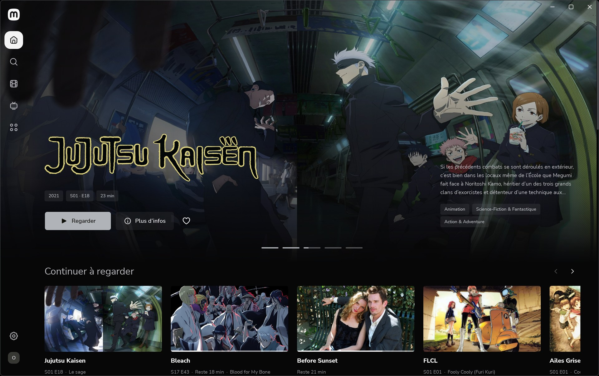
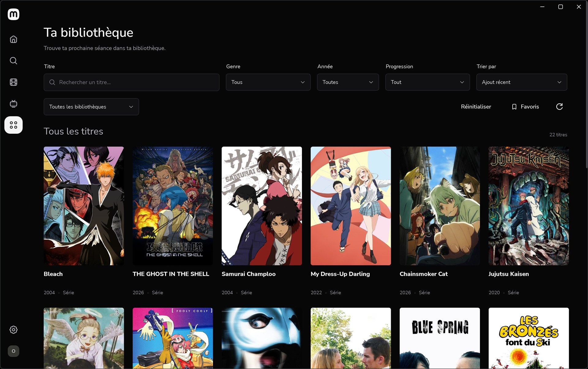
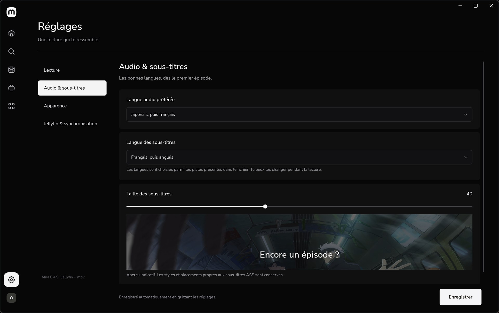

<div align="center">
  
  <h1>Mira</h1>
  <p><strong>Ta bibliothèque Jellyfin. Le confort d’un lecteur fait pour elle.</strong></p>
  <p>Un client Windows natif, une interface cinéma et mpv directement dans l’application.</p>
  <p>
    <a href="https://github.com/sasou-web/Mira/releases"></a>
    
    
    <a href="LICENSE"></a>
    <a href="https://github.com/sasou-web/Mira/actions/workflows/ci.yml"></a>
  </p>
  <p><a href="https://github.com/sasou-web/Mira/releases/tag/v0.5.5">Télécharger pour Windows</a> · <a href="docs/SCREENSHOTS.md">Galerie</a> · <a href="docs/INSTALLATION.md">Installation</a> · <a href="docs/README.en.md">English</a></p>
</div>



> Captures de l’application réelle, connectée à une bibliothèque Jellyfin personnelle. Les affiches et illustrations appartiennent à leurs ayants droit ; aucun film, épisode ou compte n’est fourni avec Mira. Mira est un projet indépendant, encore en développement.

## Pourquoi Mira ?

Mira garde Jellyfin comme bibliothèque et lui ajoute une interface de bureau centrée sur le visionnage. Parcours tes films et séries, retrouve ta dernière lecture et regarde directement dans la même fenêtre avec **libmpv**.

- **Une bibliothèque visuelle** : bandeau panoramique, couleur adaptée à l’image, recherche, filtres, favoris et fiches avec saisons, épisodes, distribution et titres similaires.
- **Une navigation soignée** : typographie embarquée, icônes arrondies, défilement progressif, survol continu et préférence de réduction des animations.
- **Un lecteur intégré** : barre de lecture épurée découpée par chapitres, plein écran, mini-lecteur déplaçable, pistes audio et sous-titres, vitesse et passage à l’épisode suivant.
- **Une reprise fiable** : dernière lecture à gauche, progression locale, statut vu, file d’envoi persistante et reprise de synchronisation après coupure.
- **Une place dans Windows** : logo et raccourci Démarrer, icône de notification, commandes dans l’aperçu de la barre des tâches et session multimédia système.
- **Toujours à jour** (à partir de la 0.5.2) : chaque nouvelle version est téléchargée en arrière-plan, vérifiée (signature, SHA-256) et installée à la fermeture de Mira, sans toucher à tes données.
- **Un guide pour bien démarrer** : au premier lancement, Mira explique ce que font Jellyfin et Mira ; le guide (bouton **?** ou **F1**) montre où ranger tes vidéos, ouvre la page d’administration de Jellyfin et donne l’adresse à entrer sur ton téléphone ou ta TV. Après chaque mise à jour, les nouveautés sont résumées en un écran.
- **TorLink, si tu l’actives** : dans la page Téléchargements, un interrupteur installe TorLink (avec son Node.js) et ouvre son interface dans Mira ; chaque téléchargement terminé est rangé dans les dossiers de Jellyfin, nommé comme il l’attend. TorLink est un projet indépendant ; Mira ne fournit ni sources ni contenus.

<table>
  <tr><td width="50%"></td><td width="50%"></td></tr>
  <tr><td align="center">Toute la bibliothèque et ses filtres</td><td align="center">Langues et taille des sous-titres</td></tr>
</table>

[Voir la galerie de démonstration : 14 captures du catalogue fictif intégré →](docs/SCREENSHOTS.md)

## Installer

Dans la [release 0.5.5](https://github.com/sasou-web/Mira/releases/tag/v0.5.5), choisir l’un des trois fichiers :

| Fichier | Pour qui |
| --- | --- |
| **Mira-0.5.5-win-x64-setup.exe** | Recommandé. Installe Mira pour ton compte, sans droits administrateur, avec son raccourci Démarrer et sa désinstallation depuis les paramètres de Windows. |
| **Mira-0.5.5-win-x64-portable.exe** | Un seul fichier à lancer tel quel. À ranger dans son propre dossier : il y crée son dossier `data`. |
| **Mira-0.5.5-win-x64.zip** | Le dossier complet de l’application, à extraire où tu veux. |

1. Lancer l’installateur ou l’exécutable. Windows peut afficher un avertissement SmartScreen : les fichiers ne sont pas encore signés (**Informations complémentaires → Exécuter quand même**).
2. Connecter ton serveur Jellyfin (10.9 ou plus récent) — généralement `http://127.0.0.1:8096` sur le même PC ; sur le réseau, son adresse IP ou son nom suffit. Pas encore de serveur ? **Installer Jellyfin sur ce PC**, sous le formulaire de connexion, l’installe, crée les dossiers Films, Séries et Animes, le configure en français et te connecte.
3. Le moteur vidéo **mpv** : laisser cochée la case « Télécharger le moteur vidéo mpv » de l’installateur, ou choisir **Installer le moteur mpv** dans **Réglages → Lecture** (Mira le propose aussi à la première lecture). Un moteur déjà installé avec mpv.net ou Jellyfin MPV Shim est réutilisé.

**Le runtime .NET est inclus ; libmpv est téléchargé à la demande** (31 Mo, depuis les builds Windows de mpv, empreinte vérifiée). Windows 10 2004+ / Windows 11 x64, interface française, préversion non signée. Aucun abonnement ou compte Mira n’est nécessaire. Jellyfin reste lancé pour fournir la bibliothèque.

La page **Téléchargements** est facultative : TorLink s’y active d’un clic, et Mira l’installe (Node.js et TorLink, vérifiés, dans son dossier `data`) s’il n’est pas déjà sur le PC. Son terminal utilise le runtime Microsoft Edge WebView2 de Windows.

[Guide complet : moteur vidéo, raccourcis, mise à jour et dépannage](docs/INSTALLATION.md)

## Développer

Prérequis : Windows x64 et SDK .NET 8. Les tests de base n’exigent ni serveur Jellyfin ni libmpv.

```powershell
git clone https://github.com/sasou-web/Mira.git
cd Mira
dotnet restore Mira.sln --configfile NuGet.Config
dotnet build Mira.sln -c Release --no-restore
dotnet run --project tests/Mira.Tests/Mira.Tests.csproj -c Release --no-build
dotnet run --project src/Mira.Desktop/Mira.Desktop.csproj -- --demo --data .artifacts/dev-profile
```

```powershell
./tools/package.ps1          # Archive, exécutable portable, installateur (Inno Setup 6), empreintes et manifeste signé
./tools/capture-gallery.ps1  # Captures avec un profil fictif isolé
./tools/torlink-check.ps1    # TorLink réel dans Mira, état et bibliothèque isolés
./tools/update-check.ps1     # Mises à jour de bout en bout : archive, portable et installateur, flux local et clé d’essai
```

| Dossier | Rôle |
| --- | --- |
| `src/Mira.Desktop` | Interface WPF, lecteur mpv, intégration Windows, terminal TorLink |
| `src/Mira.Core` | API Jellyfin, cache SQLite, synchronisation, règles de lecture et rangement des téléchargements |
| `tests/Mira.Tests` | Tests exécutables de comportement et de persistance |
| `tools` | Publication, captures, contrôles, serveur fictif et import des ressources |
| `docs` | Guides, architecture, galerie et validation |

La compilation et les tests de base sont lancés sur Windows dans GitHub Actions. Les essais natifs du lecteur et du système ont aussi été réalisés localement ; ils ne sont pas tous couverts par le runner CI.

## État du projet

Mira **0.5.5** est une préversion utilisable pour tester le projet, avec des évolutions encore nécessaires : transcodage, choix des versions multiples d’un titre, édition des collections, distribution signée et essais approfondis HDR, multicanal et multi-écrans. Jellyfin 10.9 ou plus récent est nécessaire. Les mises à jour sont automatiques depuis la 0.5.2 ; une copie plus ancienne se met à jour une fois à la main.

- [Fonctionnalités détaillées et raccourcis](docs/USER_GUIDE.md)
- [Architecture](docs/ARCHITECTURE.md) et [validation](docs/VALIDATION.md)
- [Historique](CHANGELOG.md) et [contribuer](CONTRIBUTING.md)
- [Signaler un bug](https://github.com/sasou-web/Mira/issues/new/choose) ou [une vulnérabilité](SECURITY.md)

## Licence et crédits

Code original sous [licence MIT](LICENSE). Le logo, les icônes actuelles et les illustrations de démonstration sont dessinés pour Mira. Police **Nunito Sans** sous SIL OFL 1.1 ; composants .NET, SQLite, WebView2 et Windows selon leurs licences respectives ; **xterm.js** sous licence MIT pour le terminal TorLink. Les anciens SVG Phosphor sont conservés avec leur notice MIT. TorLink est un projet tiers, ni inclus ni modifié.

Voir [THIRD_PARTY_NOTICES.md](THIRD_PARTY_NOTICES.md) pour les attributions et [licenses](licenses) pour les textes inclus. libmpv est un composant externe, non distribué avec Mira : Mira le télécharge depuis son distributeur quand tu le lui demandes.
