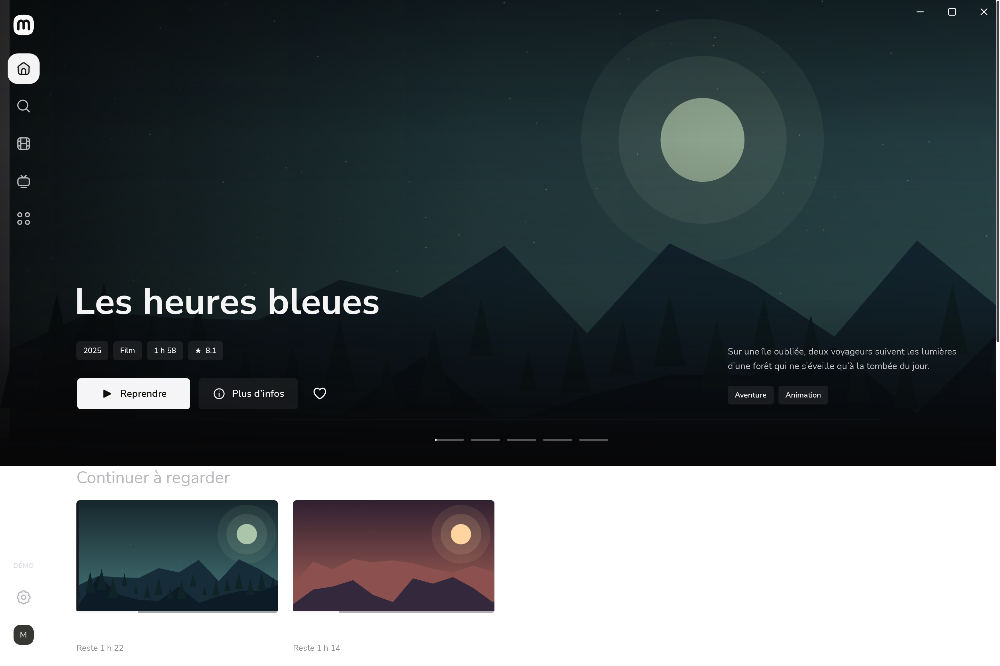

# Mira

**Your Jellyfin library, with an integrated mpv player and a native Windows interface.**

[Download Windows preview](https://github.com/sasou-web/Mira/releases/tag/v0.7.4) · [Screenshot gallery](SCREENSHOTS.md) · [Français](../README.md)



Mira keeps Jellyfin as your library server. It provides a cinematic desktop UI, search and filters, favourites, movie and series details with cast and similar titles, and playback in the same application through libmpv.

- A clean playback bar split by chapters, fullscreen and movable mini-player, audio/subtitle tracks, speed and next episode.
- Automatic updates from 0.5.2: each new release is downloaded in the background, checked (Mira's signature, size and SHA-256) and installed when Mira closes, leaving the `data` folder untouched.
- Most recently watched titles first, persistent playback reports and synchronization retries.
- Windows Start Menu identity, notification-area controls, taskbar thumbnail controls and system media session.
- Local artwork/cache, bundled typography, responsive hover transitions and reduced-motion preference.
- Optional downloads page: turning TorLink on installs it when needed (Node.js and the torlnk npm package, checked, in Mira's data folder) and opens its terminal interface inside Mira; each finished download is moved (never duplicated) into the Jellyfin library folders with Jellyfin-style names. TorLink is an independent project; Mira provides no sources or content.

## Install

Requires Windows 10 2004+ or Windows 11 **x64** and a running Jellyfin server. The packages include .NET; the **libmpv** player engine is downloaded on request (31 MB, from mpv's Windows builds, SHA-256 checked), or an existing one is reused. The UI is currently in French.

1. From the release, run `Mira-0.7.4-win-x64-setup.exe` (per-user install, no administrator rights), or use `Mira-0.7.4-win-x64-portable.exe` (one file that creates its `data` folder beside it) or the `Mira-0.7.4-win-x64.zip` folder. The files are not signed yet, so SmartScreen may ask for confirmation.
2. Keep a portable copy in a writable folder of its own.
3. Connect to Jellyfin 10.9 or later. A server on the same PC commonly uses `http://127.0.0.1:8096`; on the network, its IP address or name is enough (`192.168.1.20`, `nas:8096`), as is the address copied from Jellyfin's web page. With no server yet, "Installer Jellyfin sur ce PC" below the sign-in form handles the rest. Mira downloads Jellyfin's official installer (SHA-256 checked) and runs it after Windows asks for consent. It creates Films, Séries and Animes folders and completes Jellyfin's first-run wizard in French with your account. Then it signs in.
4. Keep the installer's "Télécharger le moteur vidéo mpv" box ticked, or use **Installer le moteur mpv** in **Réglages → Lecture** (Mira also offers it before the first playback). A `libmpv-2.dll` / `mpv-2.dll` already on the PC can be selected there instead; `mpv.exe` alone is insufficient.

The preview is unsigned. From 0.5.2 on, Mira updates itself (**Réglages → Mises à jour**); older copies need 0.5.2 installed once by hand. When updating by hand, preserve the `data` folder: it contains settings, protected session credentials and pending playback reports. Do not publish it.

## Build

On Windows, install the .NET 10 SDK, then run from the repository root:

```powershell
dotnet restore Mira.sln --configfile NuGet.Config
dotnet build Mira.sln -c Release --no-restore
dotnet run --project tests/Mira.Tests/Mira.Tests.csproj -c Release --no-build
dotnet run --project src/Mira.Desktop/Mira.Desktop.csproj -- --demo --data .artifacts/dev-profile
./tools/package.ps1
./tools/release.ps1   # packages, then the GitHub release vX.Y.Z with its files and notes (gh)
```

Tests use an executable harness, not `dotnet test`. Baseline tests require neither a live server nor libmpv. Native playback and Windows integration checks are separate local fixtures. [Contribution guide](../CONTRIBUTING.md).

The repository gallery shows real app views using the built-in fictional demo, not bundled movies. Mira is an independent development preview: transcoding, multiple versions of a title, editable collections, signing, and wider HDR/audio/multi-monitor validation remain future work.

Original code: [MIT](../LICENSE). Dependencies retain their [own licences](../THIRD_PARTY_NOTICES.md).
