# Galerie de Mira 0.4.9

Ces **14 captures** sont rendues par l’application WPF réelle à partir de son catalogue fictif intégré. Elles ne contiennent ni compte personnel, ni historique réel, ni médias fournis par Jellyfin. Les illustrations vectorielles appartiennent à la démonstration ; avec un serveur connecté, les affiches et les fonds viennent de ta bibliothèque.

Les captures montrent les vues de navigation et de réglages. Elles ne montrent pas la vidéo native mpv ni les panneaux système Windows. Les comportements de ces composants sont documentés dans [VALIDATION.md](VALIDATION.md).

## Accueil et bibliothèque


*Bandeau panoramique, indicateurs de durée et reprise de lecture.*

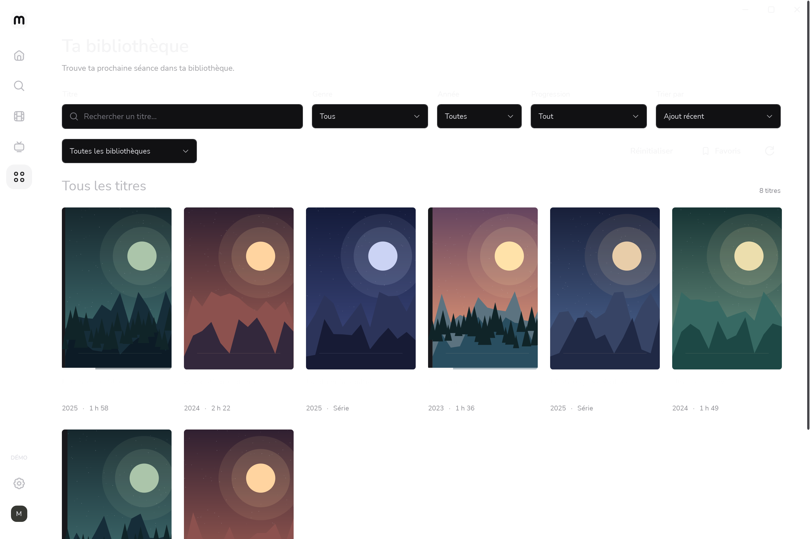

*Recherche, genres, année, progression et tri.*

| Films | Séries |
| --- | --- |
| 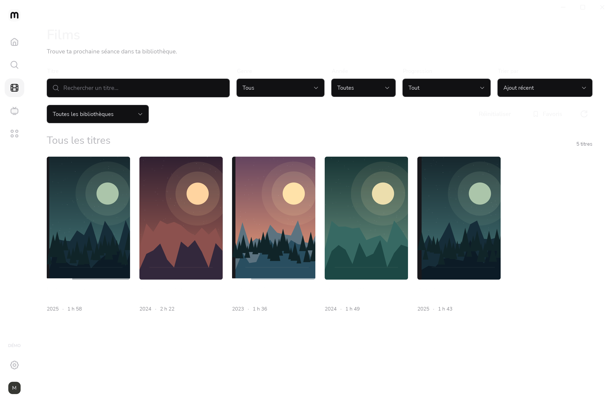 | 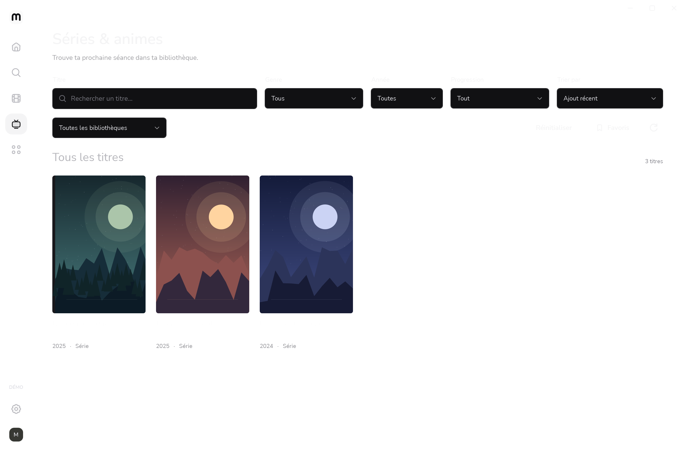 |

## Choisir une séance

| Favoris | Fiche d’un film |
| --- | --- |
| 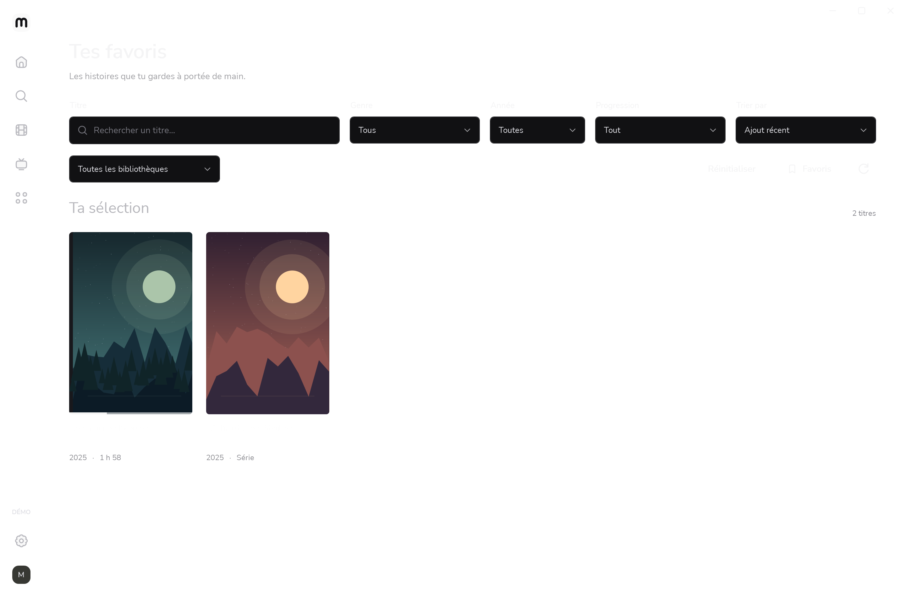 | 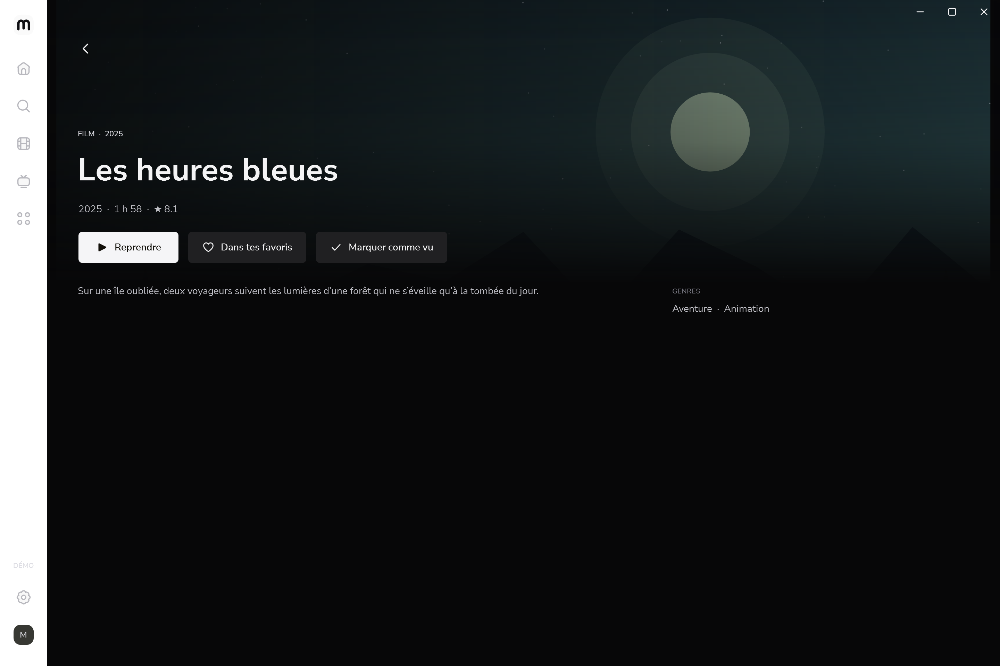 |

| Survol intégré | Recherche |
| --- | --- |
| 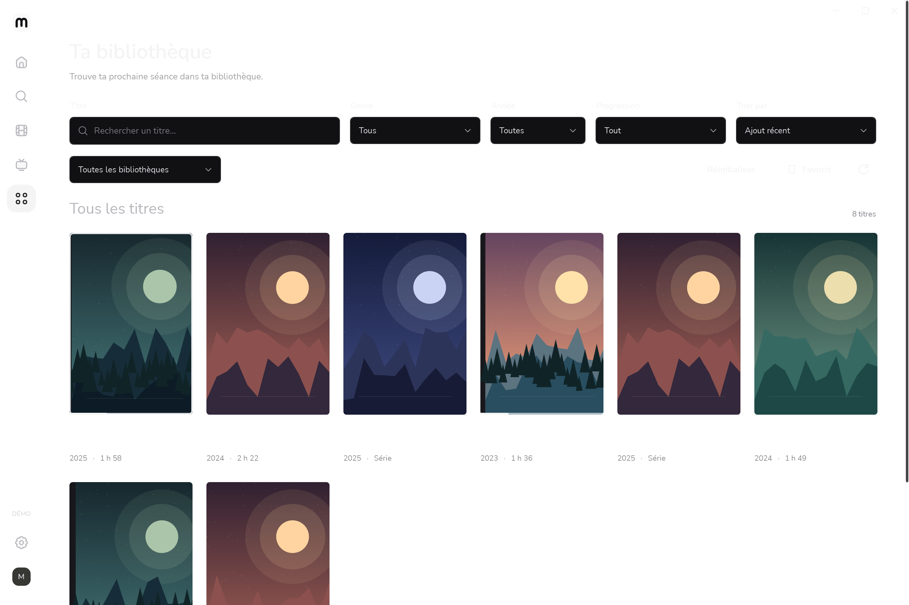 | 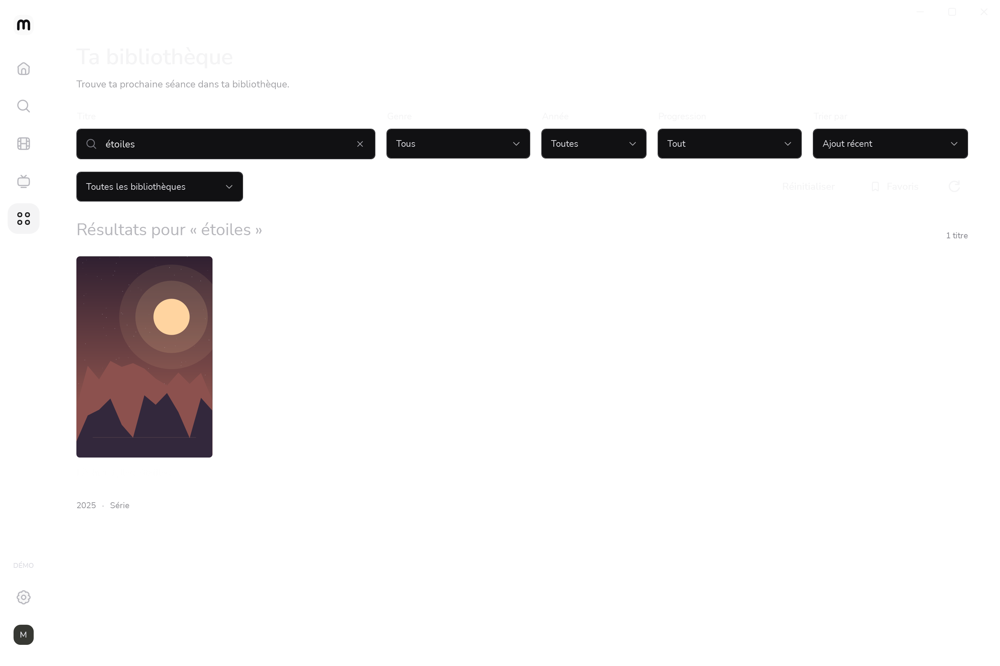 |

## Réglages

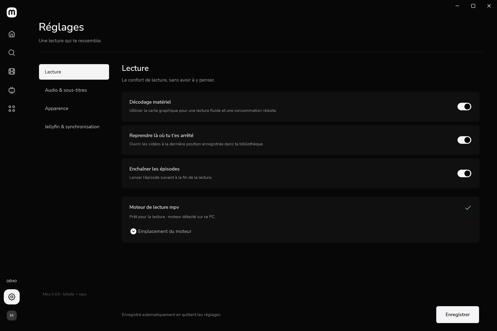

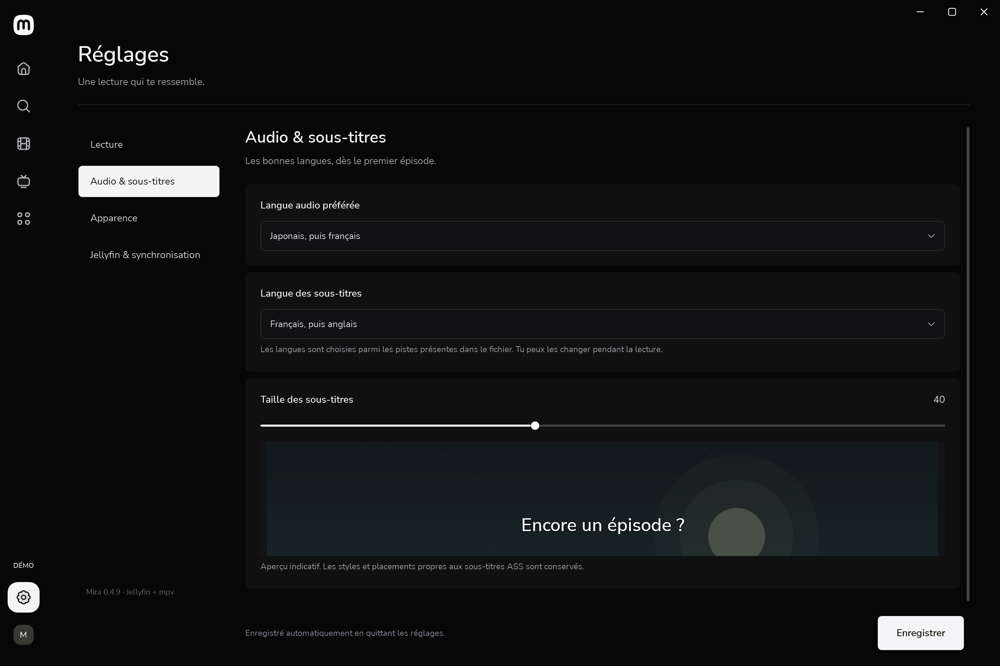

| Apparence | Jellyfin et synchronisation |
| --- | --- |
| 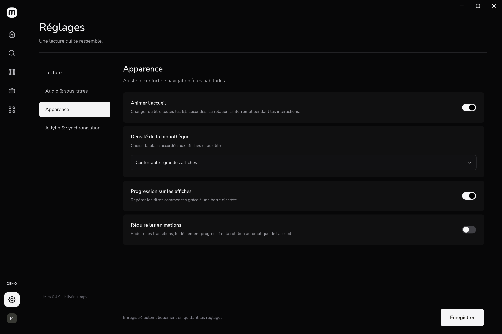 | 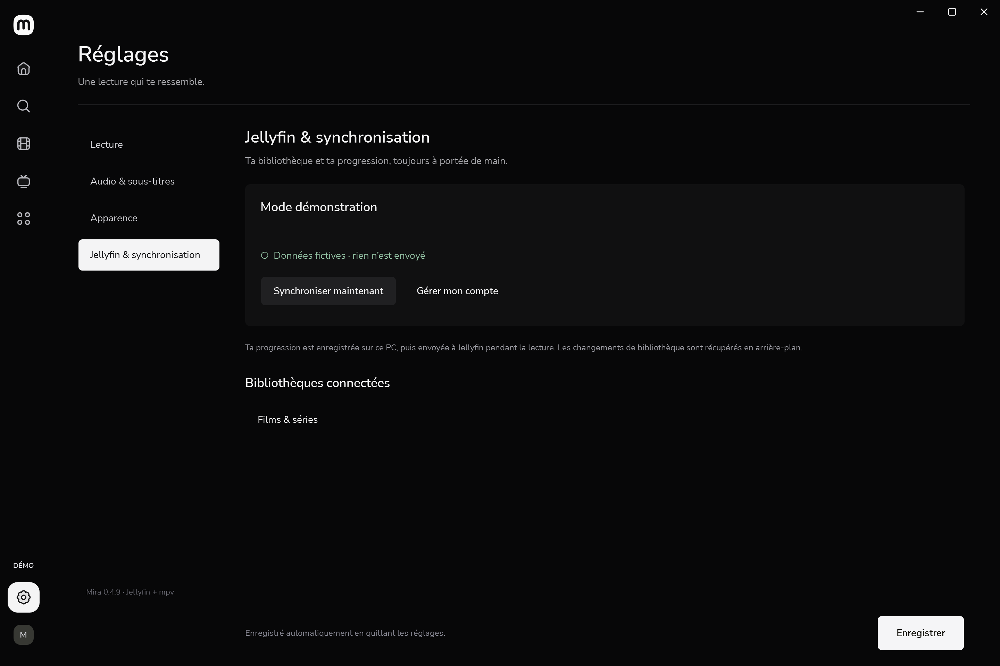 |

## Fenêtre compacte et connexion

| Fenêtre 1024 × 720 | Connexion |
| --- | --- |
| 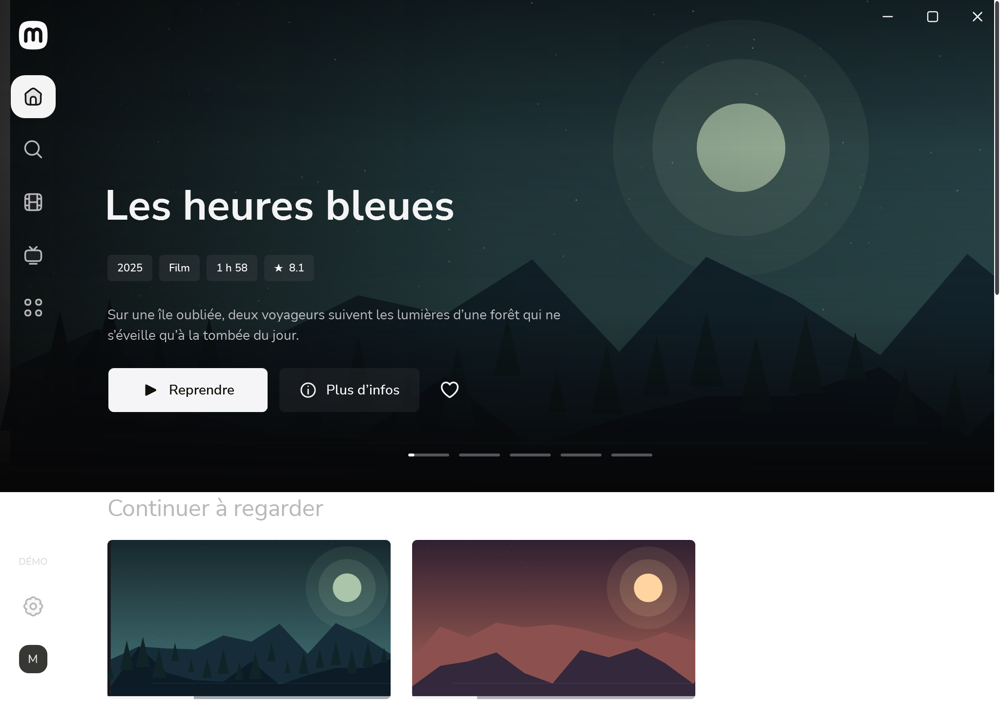 | 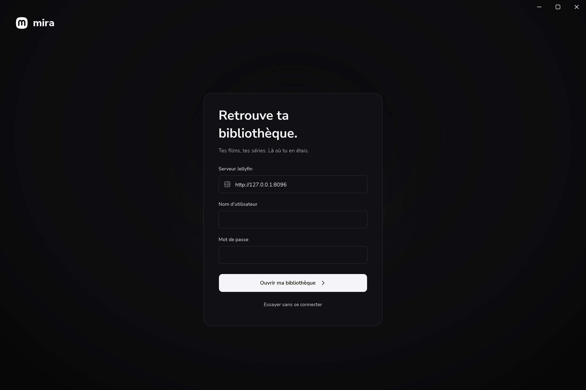 |

Les captures ordinaires utilisent une fenêtre de 1440 × 960 unités WPF. L’export suit le DPI de Windows : la résolution PNG peut être supérieure à ces dimensions logiques.

Pour les reproduire sur Windows avec le SDK .NET 8 :

```powershell
./tools/capture-gallery.ps1
```

Le script crée un nouveau profil sous `.artifacts`, utilise `--demo` et ne contacte pas de serveur. Il copie seulement les captures numérotées dans `docs/screenshots`.
